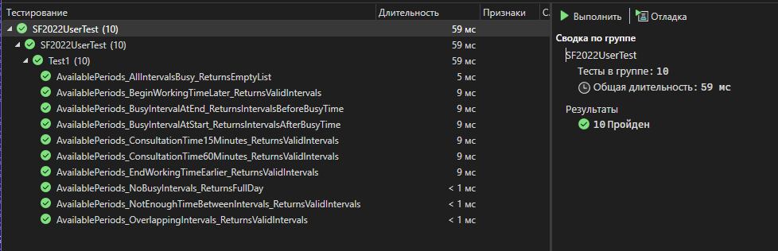

# Calculate

Проект на С#, с библиотекой длл для расчета списка свободных временных интервалов (заданного размера) в графике сотрудника для формирования оптимального графика работы сотрудников.

## Начало работы
Эти инструкции предоставят вам копию проекта и помогут запустить на вашем локальном компьютере для разработки и тестирования.

### Необходимые условия для установки проекта:

Программные приложения:
* Visual Studio Community 2022 Версия 17.11.4`
* Бразуер (Yandex, Google, Edge)
* Подключение к интернету
* Установленный GitBash
Системные характеристики:
* Операционная система: Windows 10 версии 1909 или новее, Windows Server 2016 и новее.
* Процессор: 1,8 ГГц или быстрее, рекомендуется 4-ядерный процессор или выше.
* Оперативная память (RAM): минимум 4 ГБ, рекомендуется 16 ГБ.
* Место на жёстком диске: минимум 20–50 ГБ свободного пространства, в зависимости от компонентов, которые планируется установить.
* Графическая карта: видеокарта с поддержкой DirectX 11 или выше.
* Разрешение дисплея: минимум 1366×768, рекомендуется 1920×1080 или выше.

### Установка проекта:
1. Склонировать проект 
   ```bash
    git clone https://github.com/ArrayKat/SF2022UserProject.git
   ```
2. Открыть проект в Visual Studio
3. Собрать проект на вашем ПК

## В данном проекте реализовано:
1. Библиотека в соответствии с техническим заданием
2. 10 unit-тестов на основе технологии TDD для библиотеки. 

Разработаны тесты, которые проверяют что метод из библиотеки правильно сформирует значения в следующих случаях:
- `AvailablePeriods_NoBusyIntervals_ReturnsFullDay()` - нет занятых промежутков
- `AvailablePeriods_BusyIntervalAtStart_ReturnsIntervalsAfterBusyTime()` - занятый промежуток в начале рабочего дня
- `AvailablePeriods_BusyIntervalAtEnd_ReturnsIntervalsBeforeBusyTime()` - занятый промежуток в конце рабочего дня
- `AvailablePeriods_NotEnoughTimeBetweenIntervals_ReturnsValidIntervals()` - недостаточно времени для консультации
- `AvailablePeriods_ConsultationTime60Minutes_ReturnsValidIntervals()` - консультация длительностью в 1 час
- `AvailablePeriods_OverlappingIntervals_ReturnsValidIntervals()` - занятые промежутки перекрываются
- `AvailablePeriods_EndWorkingTimeEarlier_ReturnsValidIntervals()` - рабочий день заканчивается раньше
- `AvailablePeriods_BeginWorkingTimeLater_ReturnsValidIntervals()` - рабочий день начинается позже
- `AvailablePeriods_ConsultationTime15Minutes_ReturnsValidIntervals()` - консультация длительностью 15 минут
- `AvailablePeriods_AllIntervalsBusy_ReturnsEmptyList()` - все промежутки заняты

## Описание коммитов
| Название | Описание |
|-------------|--------------|
| feat  | добавление новой функциональности     |
| fix    | исправление ошибок |
| docs  | изменения в документации |
| style    | изменения, не влияющие на функциональность, форматирование |
| refactor  | изменение кода без добавления новой функциональности или исправления ошибок |
| test  |добавление тестов или исправление существующих|

## Автор
Я в 
[Gogs](http://gogs.ngknn.ru:3000/ArrayKat2),
[GitHub](https://github.com/ArrayKat)
